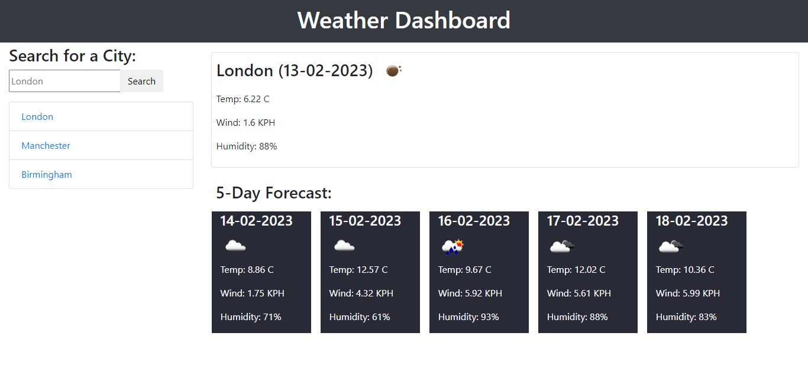

# Weather Dashboard

## Description
This is a Weather Dashboard.This shows the current and future weather condition to the user entered city.And that city is also added to the search history. Here is the deployed website link [Weather Dashboard](https://haroon-dev13.github.io/weather-dashboard/)

## Installation
To use this Website you do not need to install any software or tool.You just need a browser and internet connection to visit this website.

## Usage
This is a Weather Dashboard.When a user searches for a city this will present current and future conditions for that city and that city is added to the search history.
Given below is the screen short of example output.

* ### Weather Dashboard:

## Credits
N/A

## License
Copyright (c) 2023 Haroon-Dev
